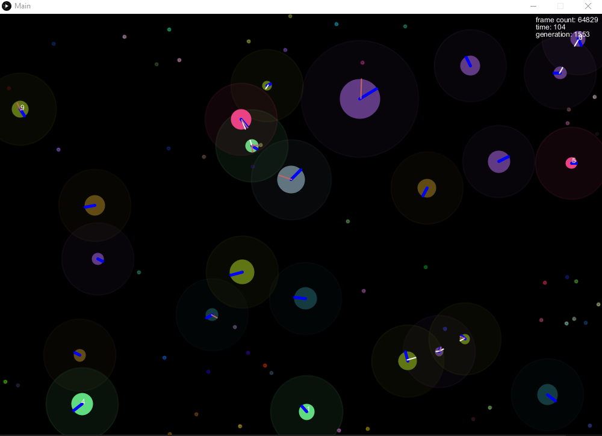

# Blobs

Blobs is an environment full of blob like organisms that fight for survival by eating food and eachother.  The organisms that eat the most and live the longest have a higher chance for their genes to be included in the reproduction of the next blob.  Over time, (kind-of) intelligent behaviour will emerge.  Feel free to tweak the settings, specifically the fitness function, to obtain various results.  I have yet to convince the blobs to only try eat blobs of smaller size, they seem to go for an all or nothing strategy of eat everything or run away from everything.

## Install/Run
Download the Processing IDE: https://processing.org/.  This was last tested with version 3.5.4

Within the `library` folder of this repository, copy the `jblas` folder over to the processing IDE's library folder.  To find the processing library folder, go to file/preferences/sketchbook location on the processing ide. The jblas library was downloaded from here: http://www.java2s.com/Code/Jar/j/Downloadjblas123jar.htm

To run the program, open the `Main.pde` sketch and hit run in the processing IDE.

## Image

